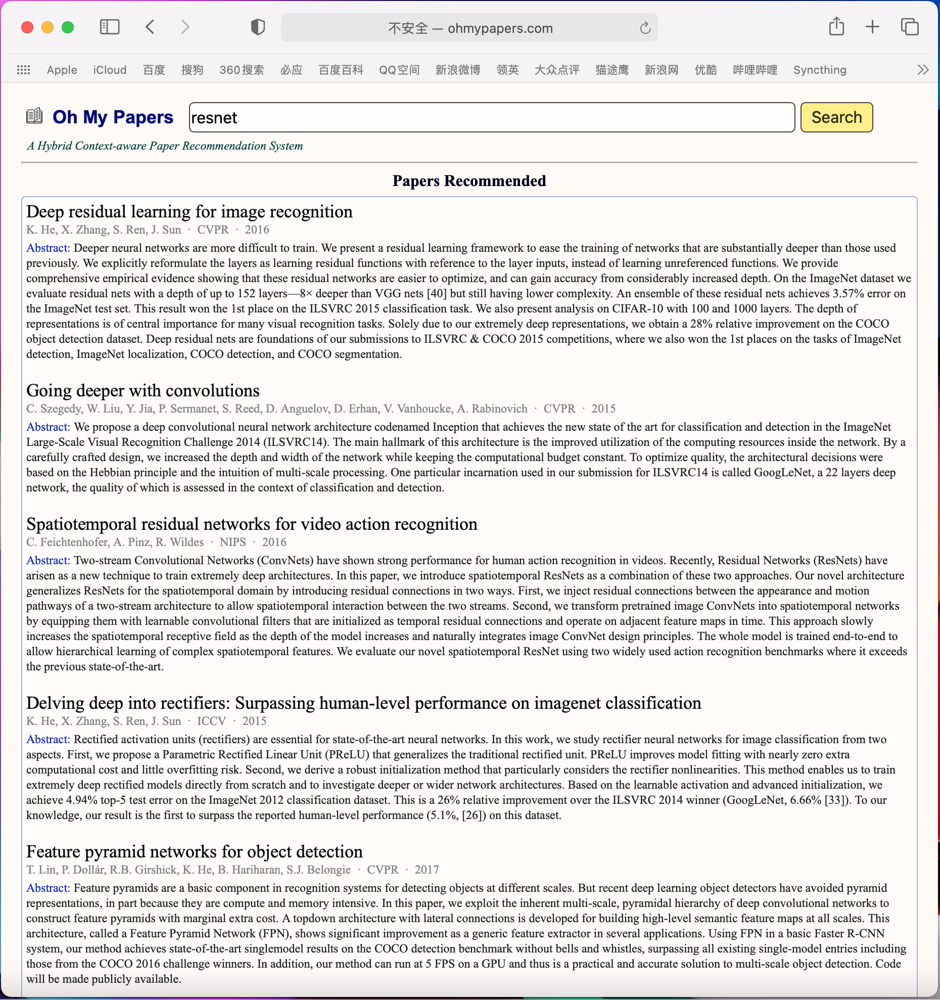

# oh-my-papers-website

This is a front-end completion of "Oh My Papers".

You can test the program locally through "PHPStudy". For example, you may create a local website with a domain name "www.ohmypapers.com" in "PHPStudy". Put all the files from "front-end/" in your local path "/phpstudy/WWW/www.ohmypapers.com/".

Enter "back-end/". Download files from [oh-my-paper](https://github.com/Galaxies99/oh-my-papers) and put them in "back-end/". After training, run the following command:

~~~bash
python3 run.py
~~~

Then type "www.ohmypapers.com" in your browser, and you will be able to use this application.

Some detailed information can be shown in [docs/front-end.md](https://github.com/zhao-hr/oh-my-papers-website/blob/main/docs/front-end.md) and [docs/back-end.md](https://github.com/zhao-hr/oh-my-papers-website/blob/main/docs/back-end.md)
