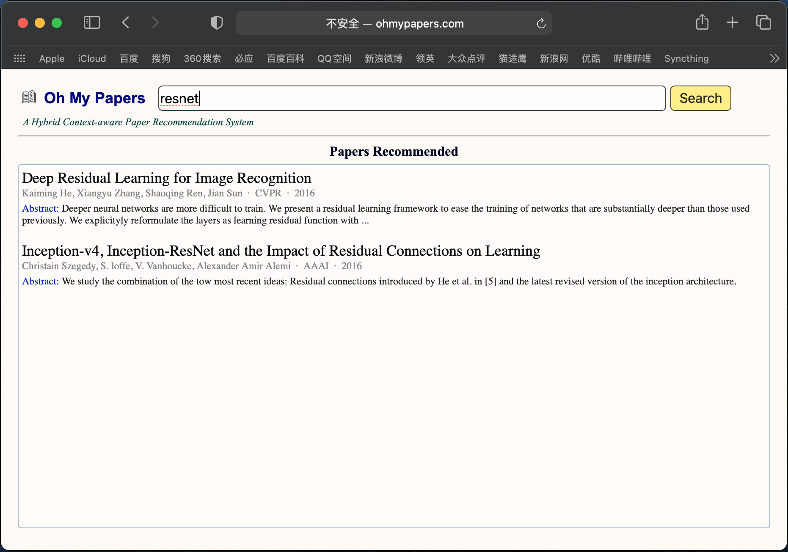

# oh-my-papers-website

This is a front-end completion of "Oh My Papers".

You can test the program locally through "PHPStudy". For example, you may create a local website with a domain name "www.ohmypapers.com" in "PHPStudy". Put all the files from this repo in your local path "/phpstudy/WWW/www.ohmypapers.com/".

In "/phpstudy/WWW/www.ohmypapers.com/", run the following command:

~~~bash
python3 back_end/src/run.py
~~~

Then type "www.ohmypapers.com" in your browser, and you will be able to use this application.

In the above example, the front-end sends a string to the back-end in the format as follows:

~~~
'{
  "inference": [
    {
      "context": "resnet"
    }
  ]
}'
~~~

And the front-end should receive a string from the back-end in the format as follows:

~~~
'{
  "inference": [
    {
      "result": [
        {
          "title": "Deep residual learning for image recognition", 
          "abstract": "Deeper neural networks are more difficult to train...", 
          "venue": "CVPR", 
          "year": 2016, 
          "author": "K. He, X. Zhang, S. Ren, J. Sun"
        },
        {
          "title": "Going deeper with convolutions", 
          "abstract": "We propose a deep convolutional neural network architecture...", 
          "venue": "CVPR", 
          "year": 2015, 
          "author": "C. Szegedy, W. Liu, Y. Jia, P. Sermanet, ..."
        }
      ]
    }
  ]
}'
~~~

What should be paid attention is that the back-end in this repo is just a simple test. Detailed information about the simple test is shown in "back_end/test.md".
